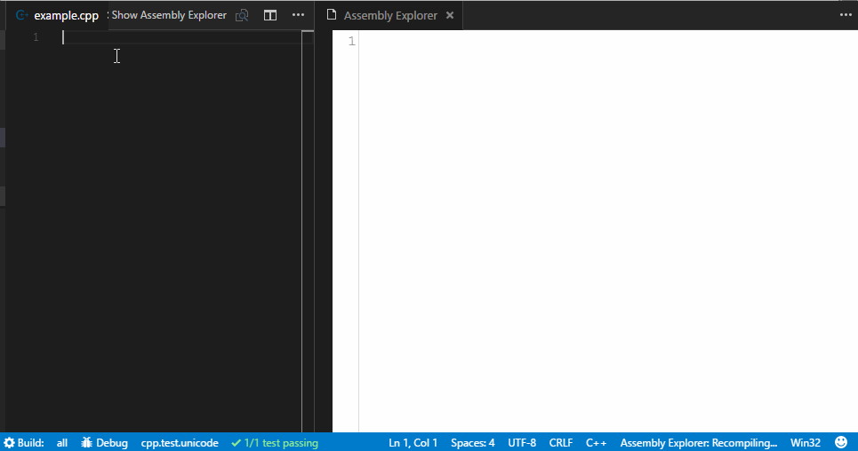
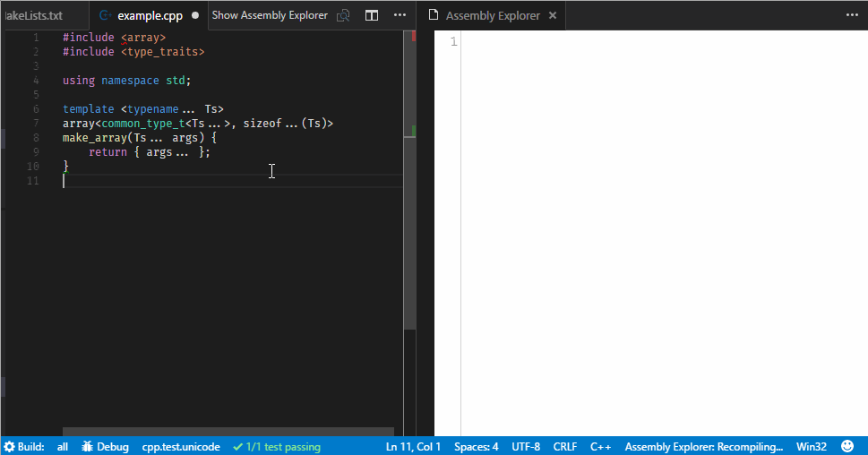

# Assembly Explorer for Visual Studio Code

### Based on Matt Godbolt's [compiler explorer](https://gcc.godbolt.org/)

Assembly Explorer lets you view the generated Assembly code for your C and C++
code as you write it!.

See how your code affects the generated assembly:

See optimizations in action:

This is still a very early version. It is buggy, missing many features, and
currently only supports MSVC.